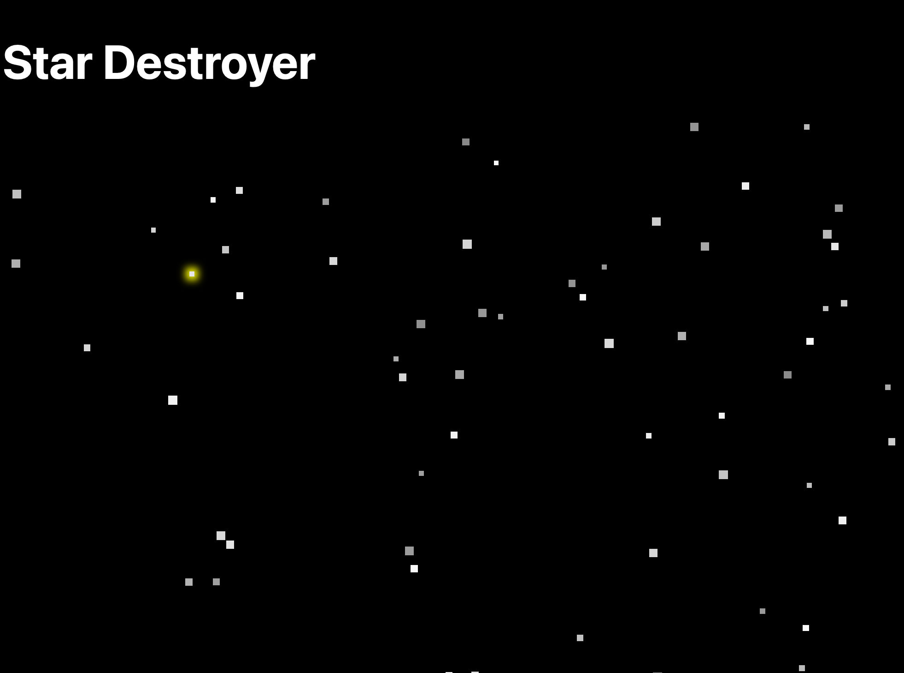

# Star Destroyer

A minimalist interactive space app built with React and TypeScript. Stars appear across the void every 2.5 seconds — click them to destroy them before they fill the sky.

**Live demo:** [perkolatte.github.io/star-destroyer](https://perkolatte.github.io/star-destroyer/)



## Tech Stack

- React 19
- TypeScript
- Vite

## Getting Started

```bash
npm install
npm run dev
```

## Deployment

This project auto-deploys to GitHub Pages on every push to `main` via GitHub Actions. The built output is pushed to the `gh-pages` branch, which is set as the publishing source in the repository settings.
